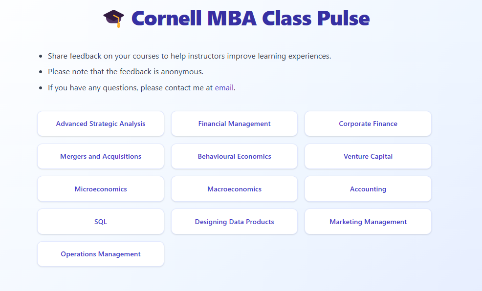
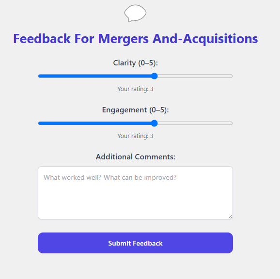
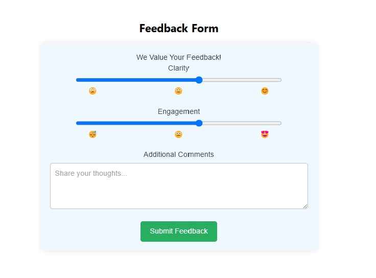
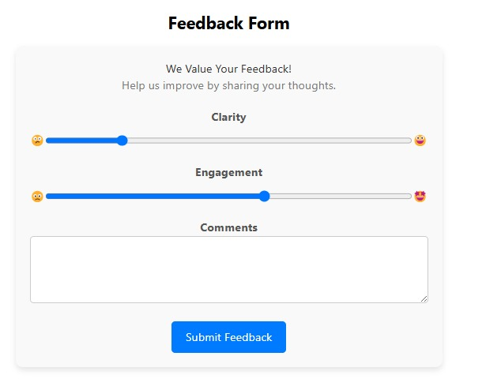
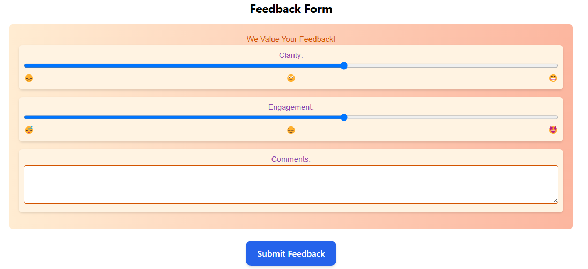

# 🧠 LLM Powered Dynamic Websites

This MVP demonstrates the use of Large Language Models (LLMs) to power fully dynamic, behavior-driven websites. At its core is a self-improving agent that learns users' preferences and regenerates UI layouts, designs and interaction models based on how users engage with the website. It leverages session tracking information and prompt-engineered LLM agents to constantly learn and evolve - a proof-of-concept for truly adaptive frontends focused on high user conversion and retention.

# 📈 MBA Class Pulse - A simple app for our prototype 

MBA Class Pulse is a simple, lightweight application designed to help current and incoming MBA students make informed course selections based on feedback provided by the seniors. It features two pages - Course selection and Feedback form. In view of a simple demonstration, the dynamic UI changes are tagged to the feedback form. A quick snapshot of each of these pages is provided below for reference. 

<table>
  <tr>
    <td>
      
    </td>
    <td>
      
    </td>
  </tr>
</table>

My goal is to perform mini A/B experimentations on UI that learns with each iteration of user sessions and interaction and recommends a UI that best fit each individaul preferences.  

# 📌 Agentic-powered Adaptive Mini A/B UI/UX Experimentation
My experimentations demonstrate an Agentic LLM-powered progressive personalization (hyperpersonalized to each user) system that combines past user session interactions from PostHog with dynamic UI generation and rendering. I logged several session interactions on PostHog that fed data to the agentic LLM system and it dynamically rendered different UI designs through 3 mini adaptive AB experiments shown below. Over these sessions, the system captured interaction patterns such as click count, time spent per section, mouse activity and submission behaviour (via PostHog analytics) tied to my persistent person_id/uuid. The server-side LLM agent analyzed my behavioral telemetry and preferences to propose incremental HTML/CSS modifications tailored to enhance retention, engagement and overall experience.  

<table>
  <tr>
    <td>
      <h3>Mini LLM powered Adaptive AB Experiment 1</h3>
      
    </td>
    <td>
      <h3>Mini LLM powered Adaptive AB Experiment 2</h3>
      
    </td>
  </tr>
</table>

<table>
  <tr>
    <td>
        <h3>Mini LLM powered Adaptive AB Experiment 3</h3>
        
    </td>
  </tr>
</table>

Each successive UI variant builds on my preference and is generated automatically based on real session signals and feedback. For instance, Experiment 1 was a quick layout test. Experiment 2 introduced spacing and emojis location changes for visual delight. Experiment 3 adapted the layout to add more warm tones increased slider spacing and a more spacious text box - all this was inferred from the implicit signals during my session such as click counts, mouse activity and duration spent to improve and increase my retention and usage ease. 

This system created an automated feedback loop allowing UI/UX'x to continuously evolve based on individual usage patterns - enabling hyper-personalization. Additionally, it provides an avenue to run hyper-personalized mini A/B experimentation that enable optimizing retention and usage strategies at each individual person level. 

Interestingly, while performing these experiments, I had a strong tendency to keep interacting with the UI just so as to know what the agentic system would recommend next - this opens up possibility of gamificiation in UI interfaces. 

# 🛠️ Tech Stack

- Frontend: React + Vite + Tailwind (inline CSS used for dynamic rendering compatibility)
- Backend Data Layer: Supabase (DB + auth)
- Tracking: PostHog (event & session replay)
- Agentic & Adaptive LLM: Built on OpenAI (GPT-4)
- Deployment: Vercel + GitHub

# 🔭 Future Work
- Plan to upgrade the UI, collaborate with the student union & run experiments on adaptive UI
- Render & perform mini A/B experimentation on artifacts based on user preference - for instance, analyze individual user preferences between video and text content formats using PostHog session data and dynamically adjust the UI to surface more of the content type that leads to higher engagement or conversion.
- Create an administrator UI for monitoring a hyper personalized UI for each unique user - compute & drive metrics at each user level, leveraging agentic systems
- Explore gamification in UI/UX changes for driving user retention

# 🚀 Go Live!
- Deployed in Vercel - [Link](https://dynamic-frontend-pysrry2xw-vidish-mehtas-projects.vercel.app/)
- Please note Agentic/LLM functionality is disabled currently to save cost💰, but I am happy to discuss if you found this project interesting. 

📬 Contact
- Built by [Vidish Mehta](mailto:vpm28@cornell.edu) as an exploration in adaptive, AI-driven UX design.
